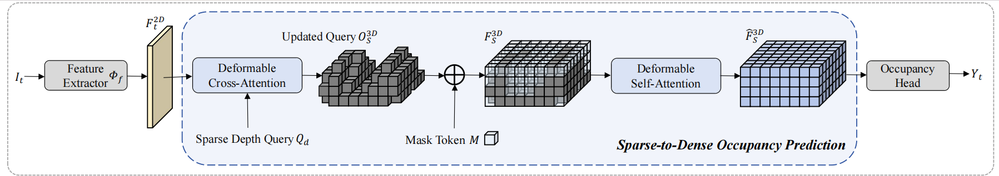
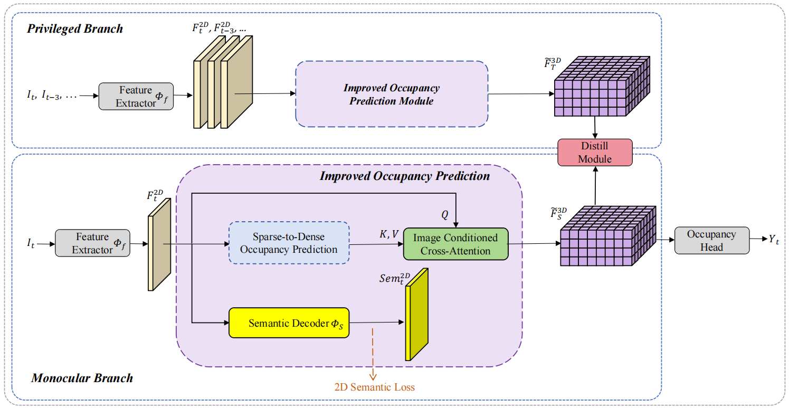
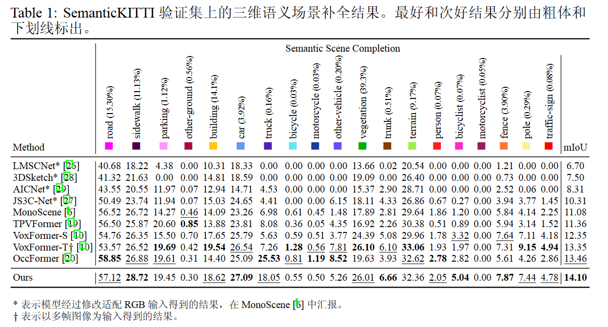
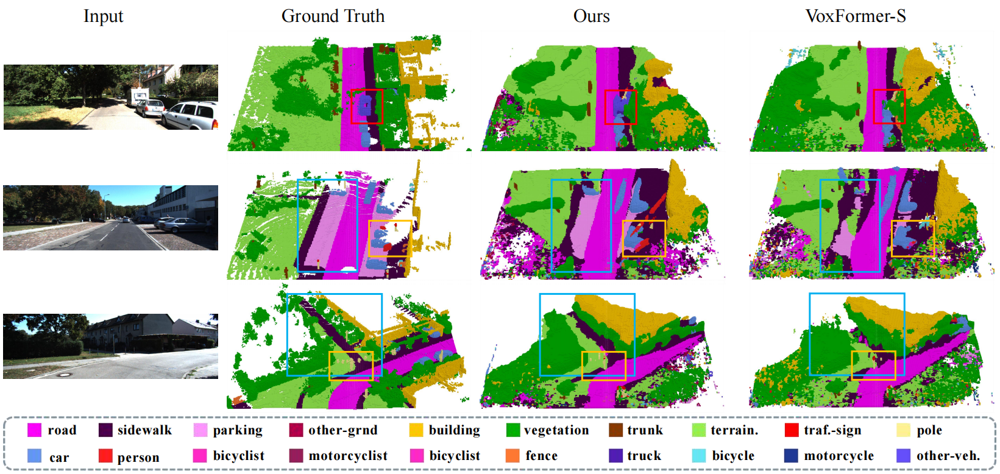

   

# 一个基于相机的三维语义场景补全任务的新框架

李想，卢天彧

人工神经网络 2023 秋季

## Abstract
为便于参考，我们将我们的贡献总结如下：

* 我们提出了一种图像条件交叉注意模块和语义辅助损失，以提高纯视觉语义场景补全的性能。
* 我们提出了一个特权分支，并引入了一个跨视图变换器，以便从时序图像中获取更多视觉信息。
* 我们提出了一个蒸馏模块，将知识从特权分支迁移到单目分支。
* 我们在 SemanticKITTI Benchmark 上实现了 SOTA 性能，验证集 SSC mIoU 表现相较基线模型从 12.35 提升到了 14.10，并公开发布了我们的代码。

## Method

基线模型 VoxFormer 的框架：

我们的改进框架：

 

其中的稀疏到密集占位预测（Sparse-to-Dense Occupancy Prediction）模块即为基线模型示意图中蓝框内的结构。

## Getting Started

- [Installation](docs/install.md) 
- [Prepare Dataset](docs/prepare_dataset.md)
- [Run and Eval](docs/getting_started.md)

## Quantitative Results

## Qualitative Results
 

## Dataset

- [x] SemanticKITTI

## Model Zoo

| Backbone  | Dataset | val set mIoU | Download |
| :---: | :---: | :---: | :---: |
| R50  | SemanticKITTI | 14.10 | model |

## Acknowledgement

Many thanks to these excellent open source projects:
- [VoxFormer](https://github.com/NVlabs/VoxFormer)
- [InternImage](https://github.com/OpenGVLab/InternImage)
- [OccFormer](https://github.com/zhangyp15/OccFormer)
- [BEVFormer](https://github.com/fundamentalvision/BEVFormer)
- [mmdet3d](https://github.com/open-mmlab/mmdetection3d)
- [MonoScene](https://github.com/astra-vision/MonoScene)
- [LMSCNet](https://github.com/astra-vision/LMSCNet)
- [semantic-kitti-api](https://github.com/PRBonn/semantic-kitti-api) 
- [MobileStereoNet](https://github.com/cogsys-tuebingen/mobilestereonet)
- [Pseudo_Lidar_V2](https://github.com/mileyan/Pseudo_Lidar_V2)

